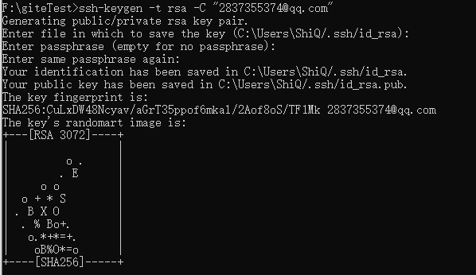
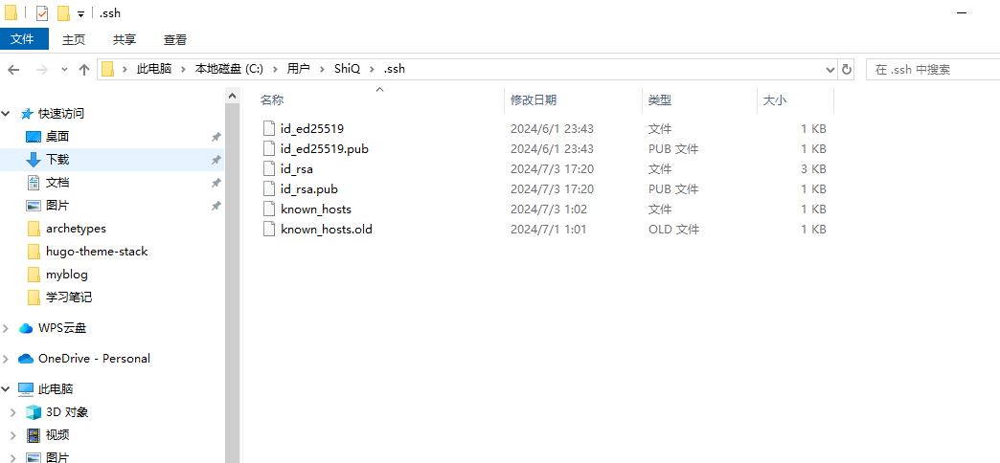
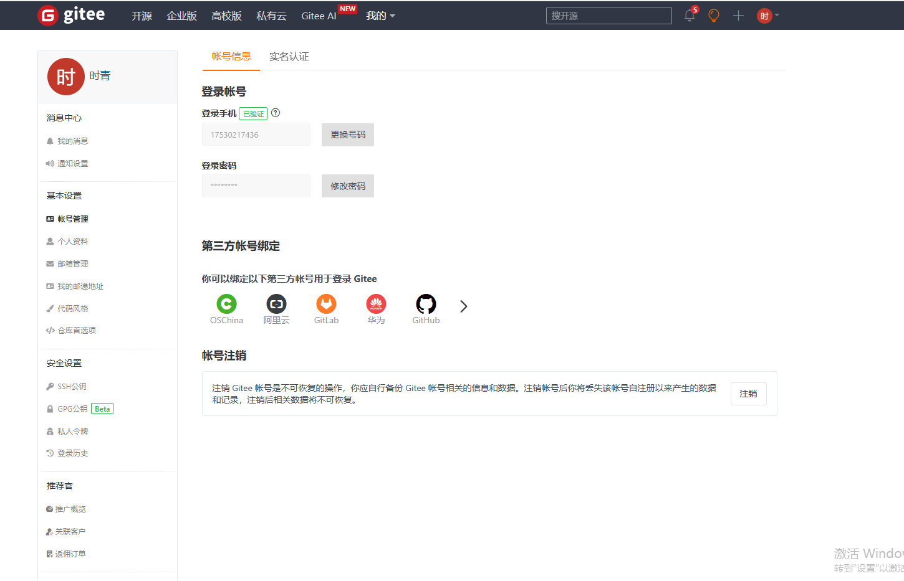
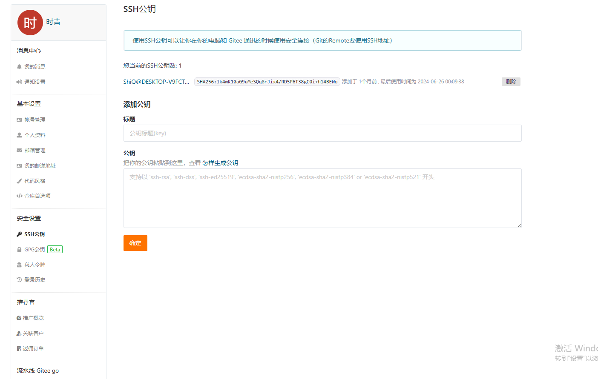
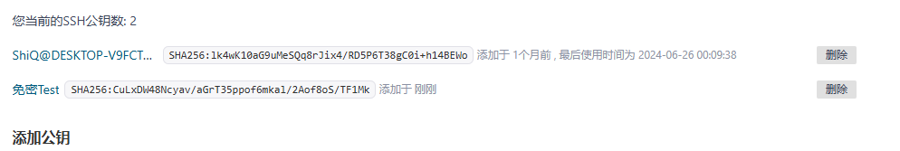
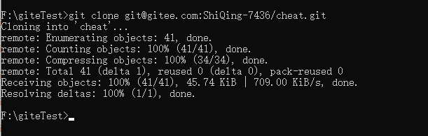

# 在忘记密码的情况下push或pull
在https连接的情况下push或pull会询问用户名和密码，每次输入用户密码会有点麻烦，所有我们可以使用SSH 来操作，公钥文件和私钥文件就成了我们免密验证的关键，以下是具体操作。

## 生成公钥文件和私钥文件

~~~bash
ssh-keygen -t rsa -C "2837355374@qq.com"
#`-t rsa`：指定生成的密钥类型是 RSA。RSA 是一种常见的公钥加密算法。#
#上面的邮箱是绑定的邮箱，本次我们拿gitee举例
~~~

输入指令之后点三次回车键

上面显示保存路径在 C:\Users\ShiQ/.ssh/id_rsa.

复制id_rsa.pub中的内容

## 配置gitee中SSH公钥

点击个人设置页面

点击ssh公钥

填写标题和公钥（刚才复制的内容）

输入gitee密码即可完成设置

再次pull代码时不会再询问用户名（邮箱）和密码

